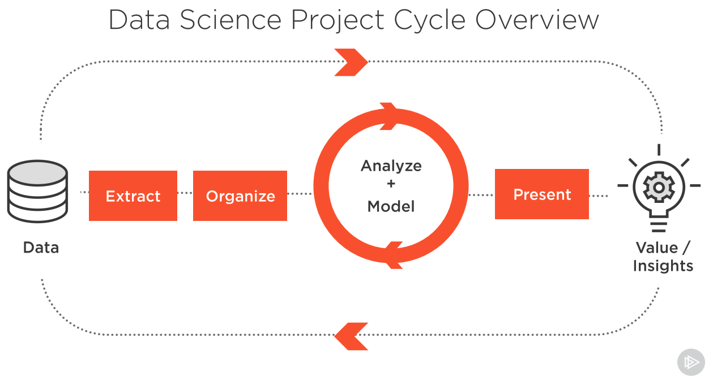

# Data Science Basics

# Glossary

**Target Function** - The target function f(x) = y is the true function *f* that we want to model.

**Normal Distribtion** - a continuous probability distribution that is symmetrical around its mean. Resembles a bell curve where the mean, the standard deviation is 1, the skew is zero, the kurtosis of 3 and the median and mode are equal for a unimodel distribution. 

**Classifier** -  a classifier is a special case of a hypothesis or model: a classifier is a function that assigns a class label to a data point.

**Model** (or Hypothesis) - Essentially the function uses to transform input data into a prediction. The function represents what was learned by a machine learning algorithm.

**Feature** - an individual measurable property or characteristic of a phenomenon

**Feature Standardization** - a scaling technique where the values of a feature are centered around the mean with a unit standard deviation

**Regularization** - a technique used to reduce the errors by fitting the function appropriately on the given training set and avoid overfitting

**Hyperparameter** - is a parameter whose value is used to control the learning process. (Examples C, penalty)

**Penalty** - a regularization term for imposing a cost on the optimization function to make the optimal solution unique

**Underfit** - a data model is unable to capture the relationship between the input and output variables accurately, generating a high error rate on both the training set and unseen data

**Overfit** - which occurs when a statistical model fits exactly against its training data. When this happens, the algorithm unfortunately cannot perform accurately against unseen data.

**Hyperparameter Optimization** - intends to find the hyperparameters of a given machine learning algorithm that deliver the best performance

**Regression** - a technique used to reduce the errors by fitting the function appropriately on the given training set and avoid overfitting. function must be continuous

## Public Datasets

* Data.gov (www.data.gov)
* AWS Public Dataset (aws.amazon.com/public-datasets)
* UCI Machine Learning (https://archive.ics.uci.edu/ml/datasets.php)
* GitHub (https://github.com/awesomedata/awesome-public-datasets)

    // Your content

[<button class="button" type="submit"><</button>](DataScience-Notes.md)
... [<button class="button" type="submit">></button>](Code-Snippets.md)

