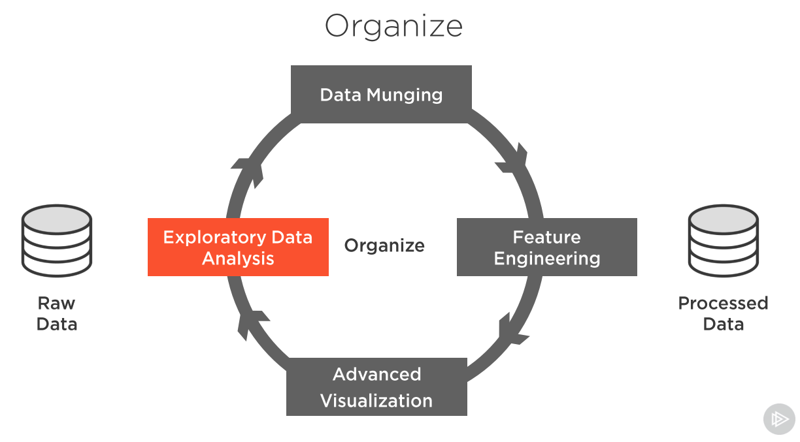

# Organize (Exploring and Processing Data)

## Exploratory Data Analysis

- Basic Structure - Determine the structure of the data which includes how many rows, columns, data types, etc

- Summary Statistic
    - Numerical Data
        - Centrality measure - one number to represent entire set of values
            - mean - CON: VULNERABLE TO EXTREME VALUES
            - median - is a safer figure to gather numberical centerality
            - mode
        - Dispersion measure - How values are spread out from the central value
            - range - diff(max - min). If range is very low, numerical data is packed together. If range is high numerical data could be spread out. CON: VULNERABLE TO EXTREME VALUES, look for outliers
            - percentiles - xth percentile is y (value) mean x% of values are below y. Box and Wisker plot is a visual version of this. 50th percentile is the median, IQR is diff of 75th percentile and 25th percentile. Outliers = Beyond 1.5 x IQR 
            - variance - how far each value is from the median. Small variance means packed packed data. Large variance means spread out data. Formuala: Variance = sum((value-mean)^2)/count.  CON: VULNERABLE TO EXTREME VALUES
            - standard deviation - Standard deviation = sqrt(variance). Low standard deviation = less spread. High standard deviation = large spread
    - Categorical Data 
        - Total Count
        - Unique Count
        - Max
        - Min
        - Category Count
        - Proportions - percent of category 
        - Per Category Statistics

- Distributions Tools
    - Box Plots - ...
    - Univariate - ...
        - Histogram - ...
        - Kernel Density Estimate (KDE) plot
            
            Skewness

            Positively or Right skewed the mean is larger of median (center line)
            Negatively or Left skewed the mean is smaller of median (center line)
    - Bivariate
        -Scatter Plot
- Grouping
    - Group by category then apply a Centrality measure
- Crosstabs - Contingency table (research future)
- Pivot Table: used to summarise, sort, reorganise, group, count, total or average data stored in a table
    
## Data Munging
Data Munging - a.k.a data wrangling, is the process of transforming and mapping data from one "raw" data form into another format with the intent of making it more appropriate and valuable for a variety of downstream purposes such as analytics

Purpose remove common issues like: 
* Missing values
* Extreme values Erroneous values

#### Treating missing values
- Deletion: Only a few records (Not recommend on)
- Imputation: Replace a missing value with a plausible value (recommended)
    - mean imputation - (vulnerable to extreme values)
    - median imputation - use the median value to replace the missing value
    - mode imputation - Good for Categorical data
    - forward/backward fill -
    
- Working with outliers

## Feature Engineering

- Derived features
- Categorical Feature encoding - transforms the categorical variable into a set of binary variables

  Creating features to make featuers

### Categorical Feature Encoding

- Binary Encoding - best used for Categories with only two values
- Label Encoding - best used for more than 2 categories with ascending ordering. (Example replacing Low, Medium, High with 1, 2, 3)
- One Hot encoding - best use for categores without ascending ordering. Create separate features (binary values) for each of the categories 

## Advance Visualization

- Processing steps
    1. Exploratory Data Analysis (Descrepancy, outliers)
    2. Data Munging - dissovle issues
    3. Feature Engineering - the process of using domain knowledge to extract features (characteristics, properties, attributes) from raw data
    4. Advanced Visualization - 

3. Evaluate Data (Analyze + Model)
4. Predictive Models (Present)