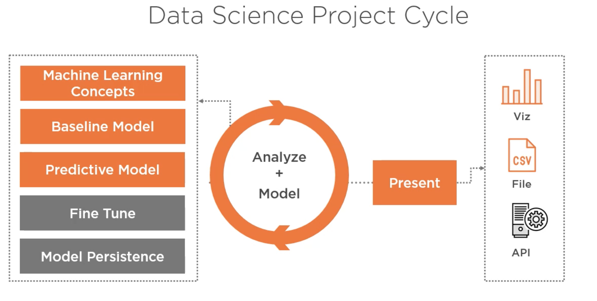
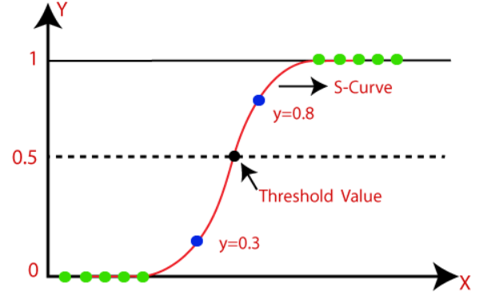

# Analyze + Mode Part 1

Analyze & Model - the process of understanding, diagnosing, and refining a machine learning model with the help of interactive visualization

# Regression Models

## Linear Regression Model

Linear Regression - a supervised machine learning algorithm where the predicted output is continuous and has a constant slope

## Logistic Regression Model

Logistic Regression - a classification algorithm used to assign observations to a discrete set of classes. Unlike linear regression which outputs continuous number values, logistic regression transforms its output using the logistic sigmoid function to return a probability value which can then be mapped to two or more discrete classes.

Examples of Categorical Data
* Binary (Pass/Fail)
* Multi (Cats, Dogs, Sheep)
* Ordinal (Low, Medium, High)

Sigmoidal (function) curve

## Testing model performance

- Train-test split
- Cross Validation (good for Hyperparameterized tuning)
    - K Fold Cross Validation - ???
- 

Cross Validation
1. Split the data into 3 parts (Training Set => Train, Crossvalidation set = Validate Training data Set, Test Set)

## Model tuning

Pick a model that you are getting the best performance and attempt to tune it with regularization and Hyperparameters

- Underfitting vs overfitting
- Regularization
- Hyperparameter tuning
- Cross validation

Feature Engineering
- Feature normalization

Model Tuning - the process of maximizing a model's performance without overfitting or creating too high of a variance

Underfitting - is unable to capture the relationship between the input and output variables accurately

Overfitting - when a statistical model fits exactly against its training data. You can avoid this with regularization.
    - Regularization -  a technique used for tuning the function by adding an additional penalty term in the error function
Regularization - 
    - Hyperparameter - is a parameter whose value is used to control the learning process. (Example C, penalty, )
        - Penalty
        - C

Hyperparameter Optimization - 

Use Crossvalidation to test you regularization hyperparameter tuning

Feature Normalization -
Feature Standardization -

https://ml-cheatsheet.readthedocs.io/en/latest/logistic_regression.html

---

